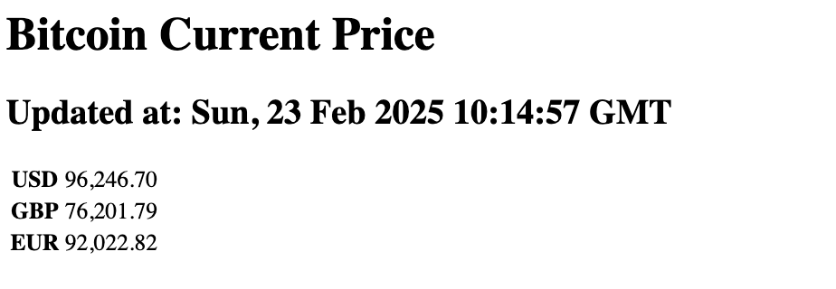

## Bitcoin Current

Maak een nieuw project aan met de naam `bitcoin-current` en installeer express volgens de instructies in de theorie les.

We gaan in deze oefening een eenvoudige express applicatie maken die de huidige prijs van Bitcoin in EUR, USD en GBP toont in een HTML pagina. Voor deze oefening gaan we gebruik maken van de volgende API: [https://sampleapis.assimilate.be/bitcoin/current](https://sampleapis.assimilate.be/bitcoin/current). 

Deze heb je al eens gebruikt in de [bitcoin-api](../../node-typescript/bitcoin-api/index.md) oefeningen.

De applicatie moet luisteren op poort 3500 en de volgende routes hebben:

- `GET /`: Toont een welkomstbericht in een HTML pagina met een link naar de `/bitcoin` route.
- `GET /bitcoin`: Toont de huidige prijs van Bitcoin in EUR, USD en GBP in een HTML pagina. De prijs moet opgehaald worden van de API en getoond worden in een tabel. 

