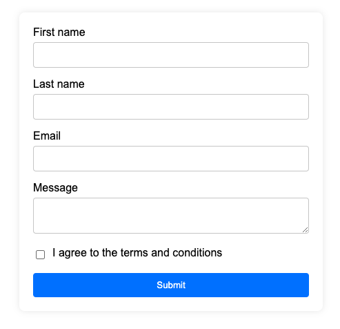
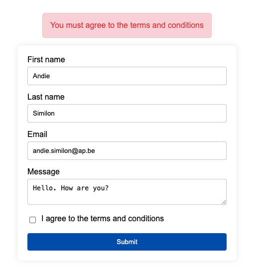
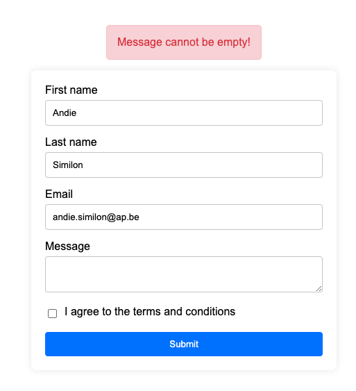
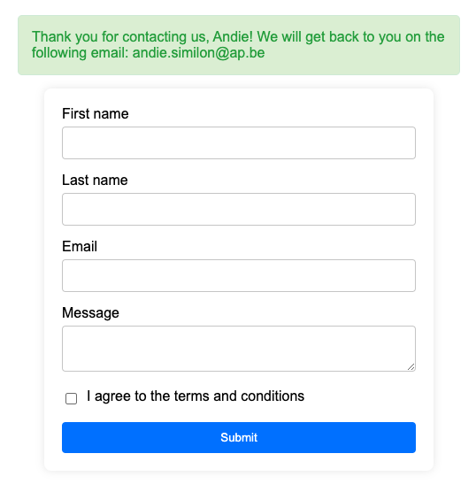

### Contact Form

Maak een nieuw project aan met de naam `contact-form` en installeer de `express` en de `ejs` module.

Maak een nieuwe route aan op `/contact` van de applicatie die een `GET` request afhandelt. De route rendert een EJS template met een contactformulier. Het contactformulier bevat de volgende velden:

- firstname (verplicht)
- lastname (verplicht)
- email (verplicht)
- message (verplicht)
- agree (voor terms and conditions) (verplicht aangevinkt)

Het formulier bevat ook een submit knop. Als het formulier wordt ingediend, wordt een `POST` request naar dezelfde route gestuurd. 

Als de gebruiker een van de verplichte velden niet invult, wordt het formulier opnieuw gerenderd met een foutmelding bovenaan het formulier. De foutmelding bevat de tekst "&#123;fieldname&#125; is required." waar uiteraard `&#123;fieldname&#125;` wordt vervangen door de naam van het veld dat niet werd ingevuld.

Als de gebruiker de terms and conditions niet aanvaardt, wordt het formulier opnieuw gerenderd met een foutmelding bovenaan het formulier. De foutmelding bevat de tekst "You must agree to the terms and conditions."

Als het formulier correct werd ingevuld, wordt een bedanktbericht gerenderd. Het bedanktbericht bevat de tekst "Thank you for contacting us, &#123;firstname&#125; We will get back to you on the following email: &#123;email&#125;" waar uiteraard `&#123;firstname&#125;` en `&#123;email&#125;` worden vervangen door de waarden die de gebruiker heeft ingevuld.

