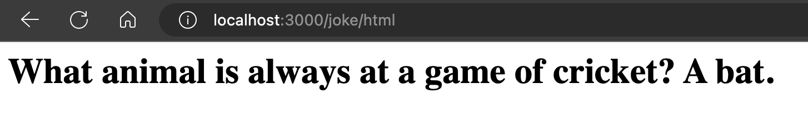
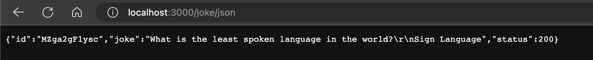

### DadJoke

Maak een nieuw project aan met de naam `dadjoke-express` en installeer express volgens de instructies in de theorie les.

Schrijf een express server die de volgende routes ondersteund:

* /joke/json
* /joke/html

Deze routes moeten allebij een dadjoke ophalen van `https://icanhazdadjoke.com/` en deze teruggeven. Als de route /joke/json is, moet de dadjoke in JSON formaat teruggegeven worden. Als de route /joke/html is, moet de dadjoke in HTML formaat teruggegeven worden. 

Bij het ophalen van de dadjoke moet je de headers aanpassen zodat de server weet dat je een JSON verwacht:

```typescript
const response = await fetch('https://icanhazdadjoke.com/', &#123;
    headers: &#123; Accept: 'application/json' &#125;,
&#125;);
```

De applicatie moet op poort 3000 draaien.

<figure><figcaption><p>/joke/html</p></figcaption></figure>

<figure><figcaption><p>/joke/json</p></figcaption></figure>