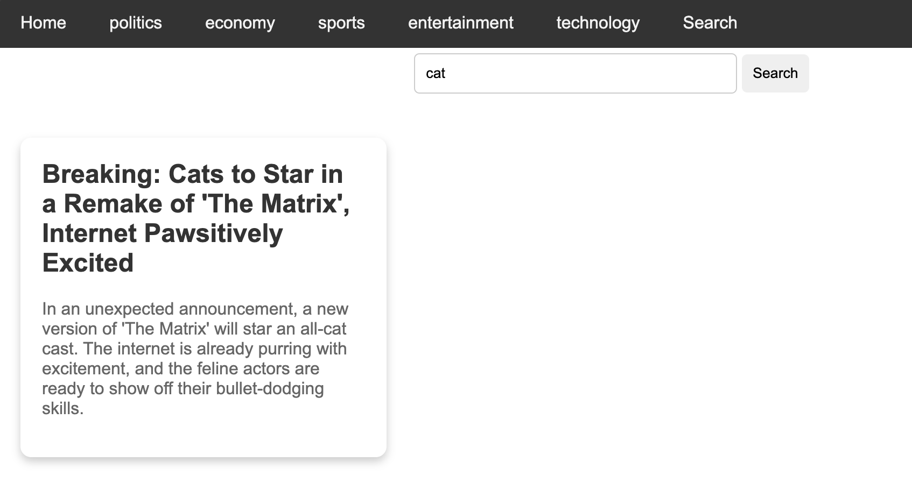

### Newspaper Search

Bouw verder aan de [newspaper-route](../newspaper-route/index.md) opdracht.

Maak een nieuwe route `/search` die een zoekformulier toont. Dit formulier moet een inputveld bevatten waarin de gebruiker een zoekterm kan invullen. Het formulier moet een GET request sturen naar de server met de zoekterm als query parameter (bv `q`).

Als de gebruiker een zoekterm heeft ingevuld, moet de server de artikels filteren op basis van de zoekterm en de artikels tonen. Als de zoekbalk leeg is, moeten er geen artikels getoond worden. We zoeken op basis van de titel van het artikel en de inhoud van het artikel.

