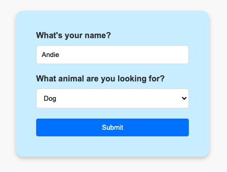
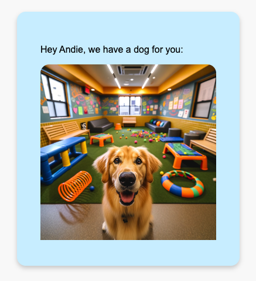

### Pet Shelter

Maak een nieuw project aan met de naam `petshelter-form` en installeer de `express` en de `ejs` module.

Maak een nieuw formulier met een invoer veld voor een naam en een dropdown voor een soort dier. De dropdown bevat drie dieren: cat, dog en rabbit. Het formulier bevat ook een submit knop. Als het formulier wordt ingediend, wordt een `POST` 
request naar dezelfde route gestuurd.

Als het formulier correct werd ingevuld wordt er willekeurig een foto van een dier gekozen met de vermelding `Hey &#123;name&#125;, we have a &#123;type&#125; for you!` waar uiteraard `&#123;name&#125;` en `&#123;type&#125;` worden vervangen door de waarden die de gebruiker heeft ingevuld.

Je moet geen input validatie doen voor dit formulier.

Je kan de afbeeldingen van de dieren vinden in deze [zip file](./animals.zip). Je kan de afbeeldingen in de map `public/images` plaatsen.

**Tips:** 
- Je hebt twee routes nodig voor dit formulier: een `GET` route om het formulier te tonen en een `POST` route om het formulier te verwerken. Ze mogen allebei dezelfde URL hebben.
- Je kan een getal tussen 1 en 5 genereren om een willekeurige afbeelding te kiezen. Je kan hiervoor de `Math.random` functie gebruiken. Alle afbeeldingen hebben een naam van de vorm `&#123;type&#125;&#123;number&#125;.png` waar `&#123;type&#125;` een van de drie dieren is en `&#123;number&#125;` een getal tussen 1 en 5. Dus bv. `cat3.png` of `dog1.png`.
- Gebruik twee verschillende ejs bestanden: een voor het formulier en een voor de response.