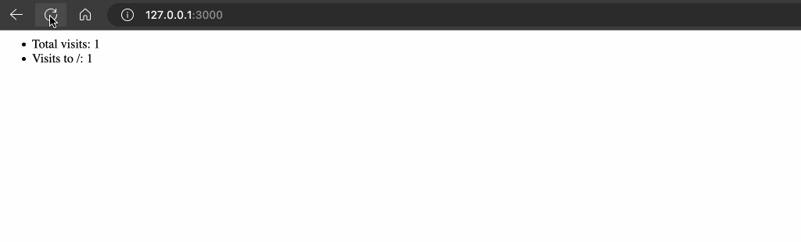

### ViewCounter

#### Opdracht

Maak een webserver in express die telkens een pagina teruggeeft met het totaal aantal bezoeken (globaal) en het aantal bezoeken per pad.

Je moet dus een globale teller bijhouden en een teller per pad (bv door een object te gebruiken dat als key het pad heeft en als value het aantal views). Bij het herstarten van de server mogen de tellers opnieuw op 0 gezet worden.

**Voor een handler te schrijven voor alle paden kan je best eens kijken hoe we de 404 handler hebben geschreven in de theorie.**

#### Voorbeeldinteractie

<figure><figcaption></figcaption></figure>
