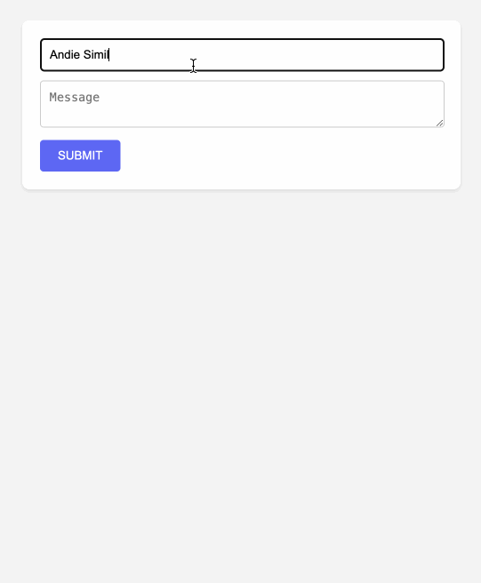

### Guestbook Express

Maak een nieuw project aan met de naam `guestbook-express` en installeer de `express` en `mongodb` package. Je kan deel van de code van de vorige [opgave](../guestbook/index.md) hergebruiken.

We gaan nu een express applicatie maken die gebruik maakt van deze database.

- Zorg ervoor dat bij het opstarten van de express applicatie een verbinding wordt opgezet met de MongoDB database. En zorg ervoor dat deze verbinding wordt afgesloten bij het afsluiten van de applicatie.
- Maak gebruik van een aparte `database.ts` module om al je database gerelateerde code in te plaatsen.
- Maak een `/` GET route aan die alle berichten toont in de database. Gebruik hiervoor een aparte `index.ejs` view. Deze view bevat een formulier om een nieuw bericht toe te voegen. Je kan een naam en een bericht ingeven.
- Zorg ervoor dat de nieuwste berichten bovenaan staan. Gebruik hiervoor een sort in de query.
- Maak een `/` POST route aan die een nieuw bericht toevoegt aan de database. Na het toevoegen van het bericht wordt de gebruiker terug gestuurd naar de `/` route. Je mag hier gebruik maken van een redirect.
- Plaats de connection string in een `.env` bestand.

