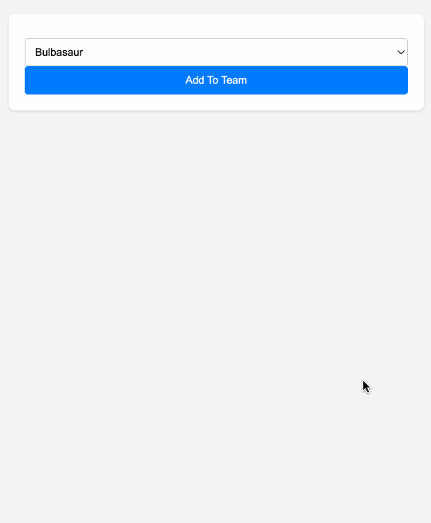

### Pokemon Team Express

Maak een nieuw project aan met de naam `pokemon-team-express` en installeer de `express` en `mongodb` package. 

We starten van de database die we gemaakt hebben in de vorige [opgave](../pokemon-team/index.md). We gaan nu een express applicatie maken die gebruik maakt van deze database.

- Zorg ervoor dat bij het opstarten van de express applicatie een verbinding wordt opgezet met de MongoDB database. En zorg ervoor dat deze verbinding wordt afgesloten bij het afsluiten van de applicatie.
- Maak gebruik van een aparte `database.ts` module om al je database gerelateerde code in te plaatsen.
- Maak een `/` GET route aan die dropdown (`select`) toont met alle pokemon in een vooraf bepaalde lijst. Onder de dropdown laat je een lijst zien van alle pokemon in het team. 
- Maak een `/` POST route aan die een pokemon toevoegt aan het team. Als de pokemon al in je team zit dan wordt deze niet toegevoegd.

