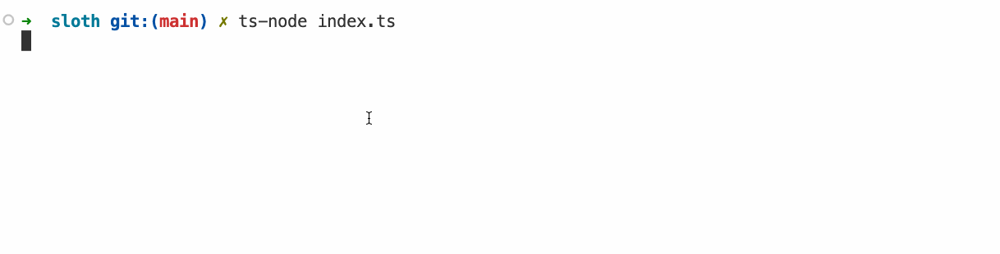

# CatGPT

Maak een nieuw project `cat-gpt` waarin je jouw bronbestanden voor deze oefening kan plaatsen.

In deze oefening gaan we een command line applicatie schrijven die de website https://catgpt.wvd.io/ nabootst. Deze website is een parodie op de zeer bekende chatgpt, alleen geeft hij geen antwoorden op je vragen, maar geeft hij een willekeurig aantal "Meow"s terug.

De applicatie werkt als volgt:
- Vraag via readline-sync input van de gebruiker aan de hand van een ">" prompt.
- Maak een functie aan "repeatWords" die een woord een aantal keer herhaalt en afprint. Plaats deze functie in een apart bestand `utils.ts` en exporteer ze. Importeer ze vervolgens in je hoofdbestand. De functie heeft 3 parameters:
    - word: het woord dat herhaald moet worden.
    - times: het aantal keer dat het woord herhaald moet worden.
    - delimiter: het teken dat gebruikt wordt om de woorden te scheiden.
- Schrijf unit tests voor de `repeatWords` functie in een apart testbestand `utils.test.ts`. Test minstens de volgende gevallen:
    - Het woord wordt het juiste aantal keer herhaald.
    - De delimiter staat correct tussen de woorden.
    - Een `times` van 1 geeft enkel het woord terug zonder delimiter.
- Gebruik de npm package "sloth-log" om een tekst vertraagd af te printen. Voor meer informatie bekijk de documentatie.
- Zorg ervoor dat elke sequentie van Meow's een willekeurig leesteken krijgt aan het einde (?,! en .).
- Zorg ervoor dat de gebruiker de applicatie kan afsluiten door "bye" in te geven. De kat zal nog een laatste keer een aantal "Meow"'s teruggeven.

## Voorbeeld interactie

