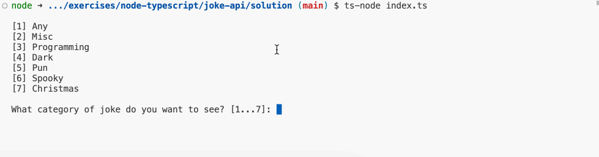

### Joke API

Maak een nieuw project aan met de naam `joke-api`.

Bij het opstarten van de applicatie worden eerst alle categorieën van grappen opgehaald. Die kan je op de volgende URL met fetch ophalen: 

https://v2.jokeapi.dev/categories

Nadat je de categorieën hebt opgehaald, kan je de gebruiker vragen om een categorie te kiezen. Vervolgens wordt er de gebruiker gevraagd om het type van de grap te kiezen. De mogelijke types zijn: `single`, `twopart`.

Vervolgens wordt er een grap opgehaald van de gekozen categorie en type. Je kan de grappen ophalen op de volgende URL:

https://v2.jokeapi.dev/joke/`&lt;categorie>`?type=`&lt;type>` bv. https://v2.jokeapi.dev/joke/Programming?type=single

Let op dat de `single` grappen een `joke` veld hebben en de `twopart` grappen een `setup` en `delivery` veld. Hou hier dus rekening mee bij het tonen van de grap.

Na het vertonen van de grap wordt de gebruiker gevraagd of hij nog een grap wil zien. Als de gebruiker `ja` antwoordt, wordt de gebruiker opnieuw gevraagd om een categorie en type te kiezen. Als de gebruiker `nee` antwoordt, wordt de applicatie afgesloten.

#### Voorbeeldinteractie:

