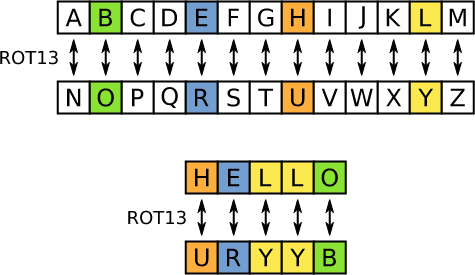

### Oefening: Rot13

Maak een nieuw project aan met de naam `rot13`.

We willen een programma maken dat een string encodeert met de rot13 methode. De rot13 methode is een simpele methode om een string te coderen. Elke letter wordt vervangen door de letter die 13 plaatsen verder in het alfabet staat. Als je aan het einde van het alfabet komt dan ga je terug naar het begin.

De gebruiker geeft een string in en het programma toont de gecodeerde string.

<figure><figcaption></figcaption></figure>

De werkwijze is als volgt:

* Je begint met een array van het alfabet in kleine letters.
* Je vraagt de gebruiker om een string in te geven.
* Je gaat door elke letter van de string en je zoekt de index van de letter in de array van het alfabet.
* Je telt 13 op bij de index en je neemt de modulo van 26. Dit is de nieuwe index van de letter.
* Je neemt de letter op de nieuwe index en je voegt deze toe aan een nieuwe string.
* Als de letter een spatie is of een ander teken dan een letter dan voeg je deze ook toe aan de nieuwe string. Je moet dus controleren of de letter in de array van het alfabet staat.

#### Voorbeeld interactie

```bash
Enter a string: hello
uryyb
```