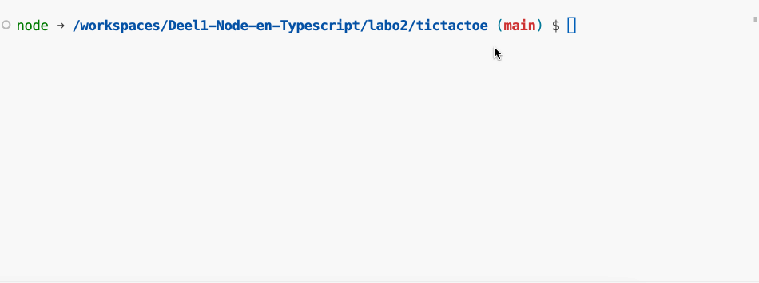

### Oefening: Tic Tac Toe

Maak een nieuw project aan met de naam `tic-tac-toe`.

We willen een programma maken dat het spelletje Tic Tac Toe kan spelen. We gaan dit doen met een 2D array. We gaan het spel spelen met 2 spelers. De eerste speler zal altijd "X" zijn en de tweede speler "O".

We werken met een 2D array van 3x3. We gaan het spel spelen met de coordinaten van de array. De bovenste rij is 0, de middelste rij 1 en de onderste rij 2. De meest linkse kolom is 0, de middelste kolom 1 en de meest rechtse kolom 2.

De gebruiker geeft de coordinaten in in de vorm van rij,kolom. Dus bijvoorbeeld 0,0 is de bovenste rij en de meest linkse kolom. 2,2 is de onderste rij en de meest rechtse kolom.

Als de gebruiker een zet doet op een plaats waar al een zet is gedaan dan krijgt hij een melding en moet hij opnieuw een zet doen.

Als de gebruiker een zet doet op een plaats die niet bestaat dan krijgt hij een melding en moet hij opnieuw een zet doen.

Als de gebruiker een zet doet die geldig is dan wordt het bord getoond. Als er een winnaar is dan wordt dit getoond en het programma stopt. Als het bord vol is en er is geen winnaar dan wordt dit getoond en het programma stopt.

#### Voorbeeld interactie:

<figure><figcaption></figcaption></figure>
