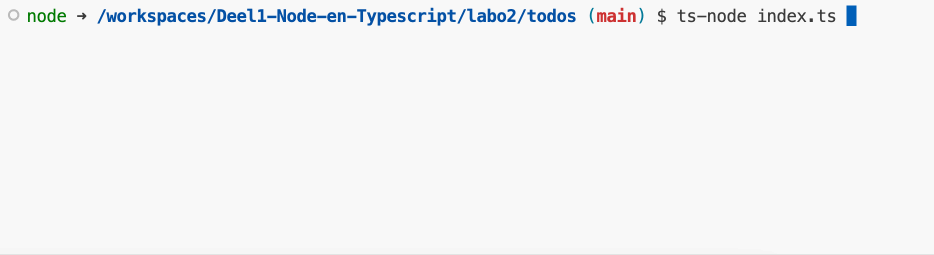

### Todo list

Maak een nieuw project aan met de naam `todo-list-string`.

We willen een programma maken dat een todo lijst bijhoudt. De gebruiker kan taken toevoegen aan de lijst. De gebruiker kan ook taken op de lijst afvinken. Voorzie bij het opstarten van het programa twee arrays. Eén voor de taken en één voor de taken die afgevinkt zijn. Een taak is gewoon een string.

Bij het opstarten van de applicatie wordt er een menu getoond. De gebruiker kan kiezen uit de volgende opties:

```
[1] Add a task
[2] Show tasks
[3] Check a task
[4] Exit
```

Gebruik hiervoor de `keyInSelect` functie van de readline-sync library.

Als de gebruiker kiest voor "Add a task" dan kan hij een taak toevoegen aan de lijst. De taak wordt toegevoegd aan de array van de taken.

```
Enter a task: Task 1
```

Als de gebruiker kiest voor "Show tasks" dan worden de taken getoond. De taken die afgevinkt zijn worden getoond met een "X" ervoor. De taken die nog niet afgevinkt zijn worden getoond met een " " ervoor. Dit zal er als volgt uitzien:

```
1. [ ] Task 1
2. [X] Task 2
3. [X] Task 3
```

Als de gebruiker kiest voor "Check a task" dan kan hij een taak afvinken. De gebruiker geeft het nummer van de taak in die hij wil afvinken. De taak wordt dan verplaatst van de array van de taken naar de array van de afgevinkte taken.

```
[1] Task 1
[2] Task 2
[3] Task 3

What did you do? [1, 2, 3]: 2
```

Als de gebruiker kiest voor "Exit" dan stopt het programma.

#### **Voorbeeldinteractie:**

<figure><figcaption></figcaption></figure>