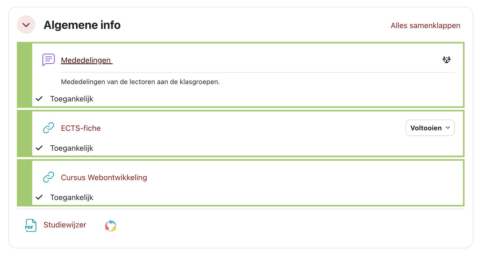

# Webontwikkeling
### Studiewijzer 

---

# Wie ben ik?

- **Andie Similon**
- andie.similon@ap.be
- Graduaat Programmeren en Bachelor Toegepaste Informatica
- Lector **Webontwikkeling** / Web Frameworks
- Interesse's en hobby's:
  - Web Development
  - Gaming
  - Muziek (gitaar, AI muziek)

---

# Wat ga je doen?

Gedaan met statische pagina's. We gaan voor **interactief** en **dynamisch**.

* **Core Tech:** We bouwen met **TypeScript** en **Node.js** (met Express).
* **Data:** Je koppelt je apps aan een echte database.
* **Full-Stack basics:** Van front-end tot server-side logica.
* **De Toekomst:** Dit is dé perfecte voorbereiding op *Web Frameworks* (React).
* **Kortom:** Je wordt klaargestoomd tot een moderne web developer.

---

# Cursusmateriaal

* **Digitap:** Je startpunt voor alles. (https://learning.ap.be/course/view.php?id=75382)
* **GitBook:** Hier staat al je theorie en oefeningen. (https://apwt.gitbook.io/webontwikkeling-2025/)

---

# Hoe ziet de week eruit?

Twee keer per week is een labo-sessie van 3 uur:

1.  **Demo Time:** De lector bouwt live een voorbeeld. **Laptops dicht/gsm's weg!**
2.  **Labo:** Zelf aan de slag met de oefeningen. Vraag snel hulp als je vastzit. **grijp niet te snel naar AI**
3.  **Thuiswerk:** Oefening niet af? Dan maak je hem thuis af.

---

# Het Project: Jouw Meesterwerk

Je werkt een heel semester aan één individueel project in **5 Milestones**:

* 🔹 **M0** Kies je onderwerp en maak een dataset (8 Februari)
* 🔹 **M1:** Maak een terminal app (8 Maart)
* 🔹 **M2:** Maak er een webapplicatie van (27 Maart)
* 🔹 **M3:** Koppel het aan een MongoDB database (10 Mei)
* 🔹 **M4:** Security & gebruikersbeheer (24 Mei)

**Finale:** In de laatste lessen presenteer én verdedig je jouw code.

---

# Hoe scoor je punten? (Eerste zittijd)

Het puntentotaal is een drieluik. Zorg dat je overal inzet!

| Onderdeel | Weging | Wat is het? |
| :--- | :--- | :--- |
| **Tussentijdse Toets** | **30%** | **Week 7**. Vaak een grote oefening die je al gemaakt hebt |
| **Project** | **30%** | De finale inzending telt + verdediging |
| **Eindexamen** | **40%** | Digitale toets in de examenperiode. Nieuwe opdracht |

---

# ⚠️ Tweede Zittijd: Belangrijke Warning

Heb je een herexamen? Let dan heel goed op:

1.  **Het Examen (70%):** Je doet een grote coding test opnieuw.
2.  **Het Project (30%):** 🛑 **DIT KAN JE NIET HERDOEN!**

**Reality Check:** Je punt voor het project uit de eerste zittijd wordt **automatisch overgenomen**. Verpruts je project tijdens het jaar, dan sleep je die onvoldoende mee naar augustus.

---

# Gebruik van AI

* **Liever niet** tijdens het leren, want je moet zelf *snappen* wat er gebeurt.
* Gebruik je het toch? Dan moet je **elke regel code** mondeling kunnen uitleggen.
* Kan je iets niet uitleggen = **0 punten** voor dat onderdeel.
* Zal HEEL streng gecontroleerd worden tijdens de projectverdediging.

---

# Hulp nodig?

Je lectoren (**David, Andie, Philippe**) staan voor je klaar.

* **Best:** Spreek ze aan tijdens de les.
* **Mail:** Antwoord binnen 48u (niet in het weekend).
* **Teams:** Sturen via Teams heeft geen zin, dat wordt genegeerd.